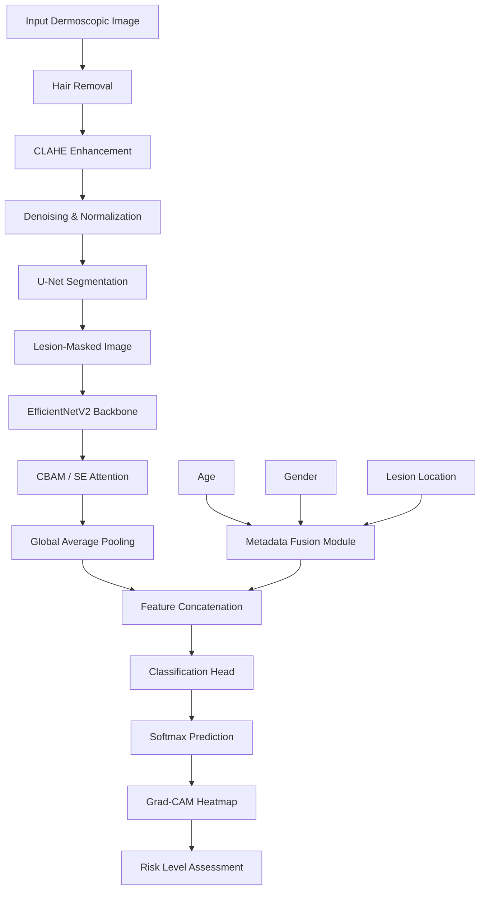

# An Explainable Hybrid Deep Learning Framework for Early Skin Cancer Detection

**Research-grade skin cancer detection system** combining image enhancement, U-Net lesion segmentation, EfficientNetV2 classification, clinical metadata fusion, attention mechanisms, and Grad-CAM explainability.

Suitable for **Final Year Thesis**, **IEEE publication**, and **clinical research prototyping**.

---

## Table of Contents

- [Architecture](#architecture)
- [Features](#features)
- [Project Structure](#project-structure)
- [Installation](#installation)
- [Dataset Setup](#dataset-setup)
- [Training](#training)
- [Testing & Evaluation](#testing--evaluation)
- [Prediction](#prediction)
- [Web Application](#web-application)
- [Model Export](#model-export)
- [Configuration](#configuration)
- [Deployment](#deployment)
- [Citation](#citation)

---

## Architecture

```
Input Image
    ↓
Hair Removal (Morphological Black-Hat + Inpainting)
    ↓
CLAHE Image Enhancement
    ↓
Noise Removal (Non-Local Means)
    ↓
Image Normalization (ImageNet stats)
    ↓
U-Net Lesion Segmentation
    ↓
EfficientNetV2 Feature Extraction (Transfer Learning)
    ↓
Clinical Metadata Fusion (Age, Gender, Lesion Location)
    ↓
CBAM / SE Attention Layer
    ↓
Dense Classification Head
    ↓
Grad-CAM Explainability
    ↓
Prediction + Risk Assessment
```

### Architecture Diagram



---

## Features

| Module | Description |
|--------|-------------|
| **Preprocessing** | Hair removal, CLAHE, denoising, normalization, augmentation |
| **Segmentation** | U-Net with encoder-decoder architecture |
| **Classification** | EfficientNetV2 with transfer learning and fine-tuning |
| **Metadata Fusion** | Age, gender, lesion location embedding and fusion |
| **Attention** | CBAM (Channel + Spatial) or SE blocks |
| **Explainability** | Grad-CAM and Grad-CAM++ heatmaps |
| **Loss Functions** | Categorical Crossentropy, Focal Loss |
| **Optimizers** | Adam, AdamW |
| **Training** | EarlyStopping, ReduceLROnPlateau, ModelCheckpoint, TensorBoard, Mixed Precision |
| **Evaluation** | Accuracy, Precision, Recall, F1, Specificity, Sensitivity, AUC, ROC, Confusion Matrix |
| **Bonus** | Auto-download, checkpoint resume, K-Fold CV, Optuna tuning, H5/ONNX/TFLite export |

---

## Project Structure

```
skin_cancer_detection/
├── dataset/                  # Dataset storage (HAM10000, ISIC 2019/2020)
├── metadata/                 # Optional metadata CSV files
├── preprocessing/            # Hair removal, CLAHE, normalization, augmentation
│   ├── hair_removal.py
│   ├── enhancement.py
│   ├── normalization.py
│   ├── augmentation.py
│   └── pipeline.py
├── segmentation/             # U-Net segmentation
│   ├── unet.py
│   └── trainer.py
├── classification/           # EfficientNetV2 + metadata fusion
│   ├── efficientnet_model.py
│   └── metadata_fusion.py
├── attention/                # CBAM and SE attention blocks
│   ├── cbam.py
│   └── se_block.py
├── explainability/           # Grad-CAM
│   └── gradcam.py
├── models/                   # End-to-end hybrid orchestrator
│   └── hybrid_model.py
├── utils/                    # Config, dataset, metrics, visualization, export
├── configs/                  # YAML configuration
│   └── default.yaml
├── app/                      # Streamlit web application
│   └── streamlit_app.py
├── notebooks/                # Jupyter demo notebook
├── outputs/                  # Generated plots, Grad-CAM, reports
├── checkpoints/              # Saved model weights
├── logs/                     # TensorBoard logs
├── train.py                  # Training script
├── test.py                   # Evaluation script
├── predict.py                # Single-image inference
├── main.py                   # Unified CLI entry point
├── requirements.txt
└── README.md
```

---

## Installation

### Prerequisites

- Python 3.9+
- CUDA-capable GPU (recommended)
- 16 GB+ RAM

### Setup

```bash
# Clone or navigate to project
cd skin_cancer_detection

# Create virtual environment
python -m venv venv
source venv/bin/activate        # Linux/macOS
# venv\Scripts\activate         # Windows

# Install dependencies
pip install -r requirements.txt

# Verify TensorFlow GPU
python -c "import tensorflow as tf; print('GPUs:', tf.config.list_physical_devices('GPU'))"
```

---

## Dataset Setup

### Supported Datasets

| Dataset | Classes | Metadata |
|---------|---------|----------|
| **HAM10000** | 7 (akiec, bcc, bkl, df, mel, nv, vasc) | age, sex, localization |
| **ISIC 2019** | 8+ | age, sex, anatomical site |
| **ISIC 2020** | Binary (benign/malignant) | age, sex, site |

### Directory Structure

```
dataset/
└── ham10000/
    ├── images/
    │   ├── ISIC_0000000.jpg
    │   └── ...
    └── metadata/
        └── HAM10000_metadata.csv
```

### Automatic Download (HAM10000)

```bash
# Configure Kaggle API credentials (~/.kaggle/kaggle.json)
python main.py download
# or
python train.py --download
```

Set `download.auto_download: true` in `configs/default.yaml` for automatic download on training.

### Manual Setup

1. Download dataset from [HAM10000 Kaggle](https://www.kaggle.com/datasets/kmader/skin-cancer-mnist-ham10000)
2. Extract images to `dataset/ham10000/images/`
3. Place CSV metadata in `dataset/ham10000/metadata/`
4. Update `data.dataset_name` in config if using ISIC datasets

---

## Training

### Full Pipeline (Segmentation + Classification)

```bash
python train.py
# or
python main.py train
```

### Segmentation Only

```bash
python train.py --segmentation-only
```

### Classification Only

```bash
python train.py --classification-only
```

### K-Fold Cross Validation

```bash
python train.py --cross-validation
```

Enable in config: `cross_validation.enabled: true`, `cross_validation.n_folds: 5`

### Hyperparameter Tuning (Optuna)

```bash
python train.py --optuna
```

### Export After Training

```bash
python train.py --export
```

### Training Configuration

Edit `configs/default.yaml`:

```yaml
data:
  dataset_name: "ham10000"
  batch_size: 16

classification:
  backbone: "efficientnetv2-b0"
  attention_type: "cbam"    # cbam, se, none
  epochs: 100

training:
  loss: "focal"             # categorical_crossentropy, focal
  optimizer: "adamw"        # adam, adamw
  mixed_precision: true
```

---

## Testing & Evaluation

```bash
python test.py
python test.py --split test
python test.py --checkpoint checkpoints/classifier_best.keras
```

### Generated Outputs

- `outputs/plots/confusion_matrix.png`
- `outputs/plots/roc_curve.png`
- `outputs/plots/classification_loss.png`
- `outputs/plots/classification_accuracy.png`
- `outputs/gradcam/*.png`
- `outputs/reports/classification_report.txt`
- `outputs/reports/evaluation_metrics.txt`

### Metrics

- Accuracy, Precision, Recall, Specificity, Sensitivity
- F1 Score, ROC-AUC
- Per-class accuracy
- Confusion matrix
- Classification report

---

## Prediction

```bash
python predict.py \
    --image dataset/ham10000/images/ISIC_0000000.jpg \
    --age 45 \
    --gender male \
    --location back
```

Output includes:
- Predicted disease class
- Confidence score
- Risk level assessment
- Grad-CAM heatmap (saved to `outputs/gradcam/`)

---

## Web Application

Launch the Streamlit interface:

```bash
streamlit run app/streamlit_app.py
# or
python main.py app
```

### Features
- Upload dermoscopic image
- Enter age, gender, lesion location
- View prediction, confidence, and risk level
- Visualize Grad-CAM explainability heatmap

---

## Model Export

Models are exported to `outputs/exports/`:

| Format | File | Use Case |
|--------|------|----------|
| Keras | `classifier_best.keras` | Python inference |
| H5 | `classifier_best.h5` | Legacy compatibility |
| ONNX | `classifier_best.onnx` | Cross-platform deployment |
| TFLite | `classifier_best.tflite` | Mobile/edge devices |

Enable/disable in config:

```yaml
export:
  save_h5: true
  save_onnx: true
  save_tflite: true
```

---

## Configuration

All hyperparameters are in `configs/default.yaml`:

| Section | Key Parameters |
|---------|----------------|
| `data` | dataset_name, batch_size, image_size, splits |
| `preprocessing` | hair_removal, clahe, denoising, normalization |
| `augmentation` | rotation, flip, zoom, brightness, contrast |
| `segmentation` | U-Net filters, epochs, learning_rate |
| `classification` | backbone, attention, dropout, fine_tune_at |
| `training` | loss, optimizer, mixed_precision, callbacks |
| `evaluation` | metrics, gradcam settings |

---

## Deployment

### Production Checklist

1. Train and validate model on full dataset
2. Export to ONNX or TFLite for inference
3. Deploy Streamlit app:

```bash
streamlit run app/streamlit_app.py --server.port 8501 --server.address 0.0.0.0
```

4. For Docker deployment:

```dockerfile
FROM python:3.10-slim
WORKDIR /app
COPY requirements.txt .
RUN pip install -r requirements.txt
COPY . .
EXPOSE 8501
CMD ["streamlit", "run", "app/streamlit_app.py", "--server.port=8501", "--server.address=0.0.0.0"]
```

### GPU Server

```bash
# Install CUDA-compatible TensorFlow
pip install tensorflow[and-cuda]
python train.py
```

---

## Model Description

### U-Net Segmentation
- Encoder-decoder with skip connections
- Binary cross-entropy loss
- Generates lesion masks to focus classification on relevant regions

### EfficientNetV2 Classifier
- Pre-trained on ImageNet (transfer learning)
- Base layers frozen initially, fine-tuned after warmup
- Global average pooling for feature extraction

### Metadata Fusion
- Age: dense embedding
- Gender: learned embedding (3 classes)
- Location: learned embedding (15 anatomical sites)
- Concatenated with image features before classification

### Attention (CBAM)
- **Channel Attention**: What features are important
- **Spatial Attention**: Where to focus in the image

### Grad-CAM
- Gradient-weighted class activation mapping
- Visual explanation of model decisions
- Automatically saved during inference and evaluation

---

## Citation

If you use this framework in your research, please cite:

```bibtex
@thesis{skin_cancer_hybrid_dl,
  title   = {An Explainable Hybrid Deep Learning Framework for Early Skin Cancer Detection
             Using Image Enhancement, Lesion Segmentation, Clinical Metadata Fusion,
             and Attention-Based Classification},
  author  = {Your Name},
  year    = {2026},
  school  = {Your University}
}
```

---

## License

This project is intended for academic and research purposes. Not for clinical diagnosis without proper validation and regulatory approval.

---

## Disclaimer

**This system is NOT a medical device.** It is designed for research and educational purposes. Always consult a qualified dermatologist for medical diagnosis and treatment decisions.
